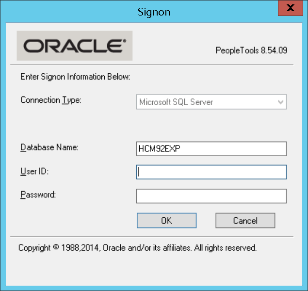
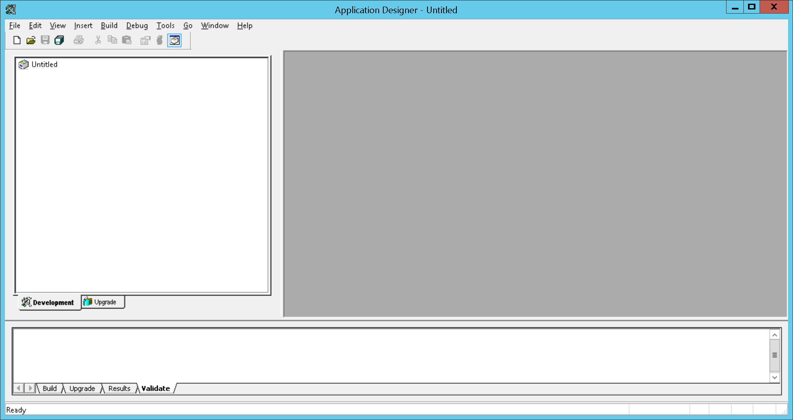
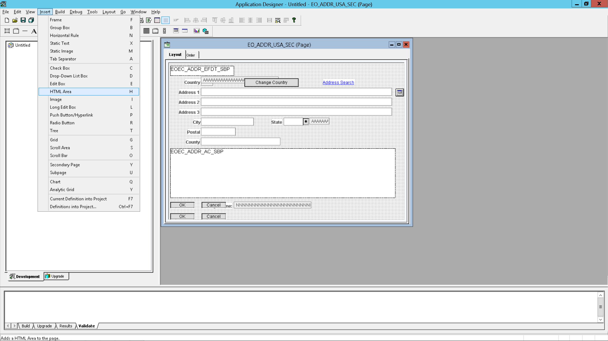
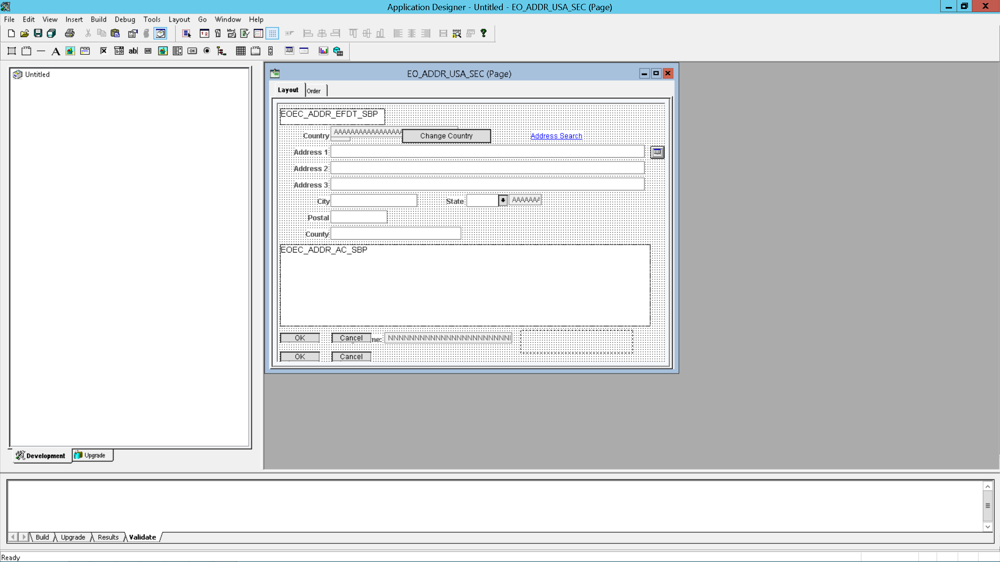
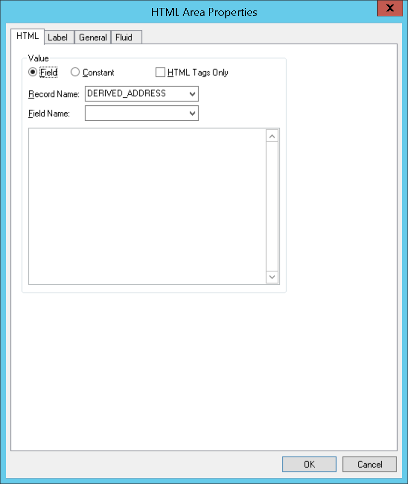
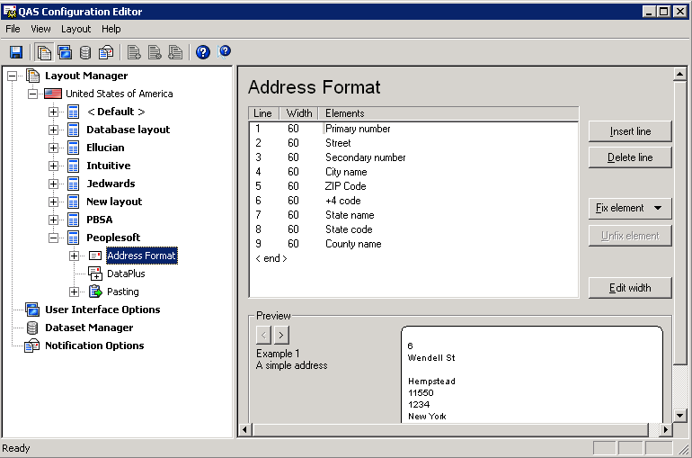

# Overview

Experian provides data quality solutions through our contact data management platform.
Specifically, we provide email and phone validation as well as address verification.
We are able to integrate into PeopleSoft to provide this functionality when interacting with their
form fields.

# Installation prerequisites
Before starting, it's important to make sure you have access to the following
things:

* PeopleTools Application Designer (we have tested this with PeopleTools 8.54 and HRMS 9.20, but older and newer versions should apply with little to no change in our instructions).
* Reverse Proxy (optional for general use, but required for use with self-hosted Pro Web).
* The integration files, which will be provided in this repository in the `src` folder.

# Installation instructions

For the purposes of this tutorial we will assume you're integrating into the Page
`EO_ADDR_USA_SEC`, however the same instructions can be used to integrate into any 
page that has form fields you'd like to integrate Experian tools with.

## Step 1
The first thing you will want to do as you begin is open up the *Application Designer*.
Once opened you should see a screen similar to the one below:

You should specify the appropriate Database name, User ID and Password so that you 
can access the tool.

## Step 2

Once you've logged in you will see the Application Designer with nothing open, as
shown below.

What you will need to do is click *File* (top left corner) and then *Open*. 
The modal should look like after selecting open and selecting a *Definition* type.

After opening, you can specify any Definition you would like, but for this tutorial select **Definition**
*Page* and under *Selection Criteria* fill in *Name* with `EO_ADDR_USA_SEC` and select *Open*.

The picture below shows how you should fill it out.

## Step 3
After opening the *Definition* you should then insert an **HTML Area**, done by selecting *Insert* and
then *HTML Area*. The picture below shows you what to select

Once selected create a rectangle for the HTML Area in the area specified by the image below.

## Step 4
Finally, once you've created and inserted your HTML Area you should double click the area you've 
now selected to view the **HTML Area Properties**. The screen below will show how this modal looks like.

Then, after configuration, put the integration HTML code in the main field after specifying the HTML **Value**
as being a *Constant*. Integration code for `EO_ADDR_USA_SEC` can be found under `src`. If you want to integrate
into a touchpoint that doesn't a file you can do so by following the section titled **Custom Touchpoints**

# Testing the integration

Once you've followed the steps specified above, you can test out the integration by going to the specified
Page (or Definition) in PeopleSoft using your web browser.

# Creating a layout (On-Premise Pro Web only)

The integration requires that each Address Line only have a single element. Modifying `Database Layout`, create a new layout in the *QAS Configuration Editor* (can be found under QAS Pro Web -> QAS Configuration Editor) and follow the below configuration settings:

It's important that your new layout have the exact configuration as specified above in order to map the items properly. 

# Custom Touchpoints
