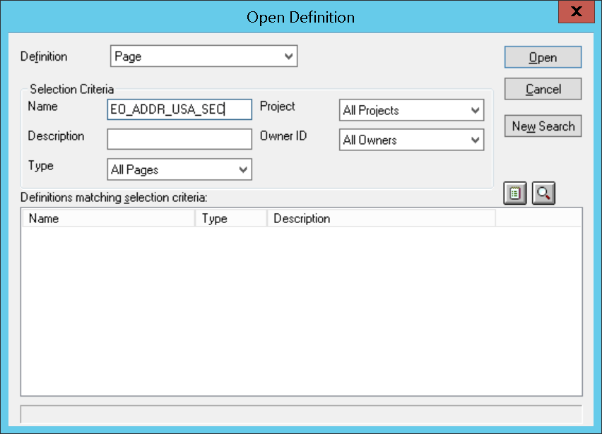

# Overview

Experian provides data quality solutions through our contact data management platform. 
Specifically, we provide email and phone validation as well as address verification. 
We are able to integrate into PeopleSoft to provide this functionality when interacting 
with its  form fields.

# Installation prerequisites
Before starting, it's important to make sure you have access to the following things:

- [PeopleTools Application Designer](https://docs.oracle.com/cd/E87544_01/pt856pbr1/eng/pt/tapd/concept_PeopleSoftApplicationDesignerOverview-0776f8.html?pli=ul_d29e24_tapd)
- [Reverse Proxy](https://github.com/experianplc/nginx-cors) (optional for general use, but required for use with self-hosted Pro Web).
- The integration files, which will be provided in this repository in the src folder.
- [Pro Web 7.73](https://www.edq.com/documentation/apis/pro-web/) (or later). If you are using a self installed Pro Web instance it must be at least version 7.

## Pro Web Layout (Optional)
If you're using Pro Web that's hosted on your own premises you will need to create a layout. Edit
your `Qawserve` file for the version of Pro Web you're using (in Windows this file will be located
by default somewhere like `C:\Program Files\QAS\QAS Pro Web 7.XX\Qawserve`, where XX is the
sub-version number.

Go to LAYOUT.md in this folder and copy the entire contents. From there paste those contents to the
Qawserve found above.

# Installation instructions (pre-created integrations)

## Selecting a pre-made integration file
We have a variety of components and pages already created for the integration. 
The find these, you can visit the src folder and follow the file path to the component, or page of
choice. 

> For example, to use the pre-created integration for the fluid page `ADDRESS_DFT_SBF` you
will need to go to `src/9.2/hcm/pages_fluid/ADDRESS_DFT_SBF`.

Each pre-made integration has a single file, `integration.html`, that should be edited to
enable the functionality that you would like. The functionality that *can* be enabled will be
reflected in the options. 

## Configuring the integration
Once you select which product you would like there is some basic configuration that needs to be
done. For this example we will assume that we are using the `EO_ADDR_USA_SEC` integration.

For example, 

```html
<div
  id="edq-9.2-hcm-pages-EO_ADDR_USA_SEC"
  PRO_WEB_AUTH_TOKEN=""
  PRO_WEB_SERVICE_URL=""
  PRO_WEB_USE_TYPEDOWN=false
  GLOBAL_INTUITIVE_AUTH_TOKEN="">
</div>
<script
  src="https://edqprofservus.blob.core.windows.net/peoplesoft/9.2/hcm/pages/EO_ADDR_USA_SEC/integration.js">
</script>
```

The following table describes the functionality possible:

| HTML Key                    | Description  |
|---------------------------- | ------------ |
| PRO_WEB_AUTH_TOKEN          | This is the auth token used for Pro Web On Demand (Verification and Typedown) |
| PRO_WEB_SERVICE_URL         | If you are using a self-hosted instance, this is the proxied URL. |
| PRO_WEB_USE_TYPEDOWN        | If you want to use Typedown, this needs to be set to true |
| GLOBAL_INTUITIVE_AUTH_TOKEN | This is the auth token used for Global Intuitive. If unset, Global Intuitive will not be used |

## Putting the integration into your environment.
Once the `integration.html` file has its configuration set you should put the file in the Definition
corresponding to the file.

### Step 1
The first thing you will want to do as you begin is open up the *Application Designer*.
Once opened you should see a screen similar to the one below:


You should specify the appropriate Database name, User ID and Password so that you 
can access the tool.

### Step 2

Once you've logged in you will see the Application Designer with nothing open, as
shown below.


What you will need to do is click *File* (top left corner) and then *Open*. 
The modal should look like after selecting open and selecting a *Definition* type.


After opening, you can specify any Definition you would like. The definition type and name will
correspond to the folder structure in `src`. So for example a definition of Page (Fluid) will
correspond to structure `src/9.2/page_fluid`.

The picture below shows how you should fill it out.


### Step 3
After opening the *Definition* you should then insert an **HTML Area**, done by selecting *Insert* and
then *HTML Area*. The picture below shows you what to select


Once selected create a rectangle for the HTML Area in the area specified by the image below.


### Step 4
Finally, once you've created and inserted your HTML Area you should double click the area you've 
now selected to view the **HTML Area Properties**. The screen below will show how this modal looks like.


Then, after configuration, put the integration HTML code in the main field after specifying the HTML **Value**
as being a *Constant*. In this case it would be configured snippet specified in the section
**Configuring the Integration**.
